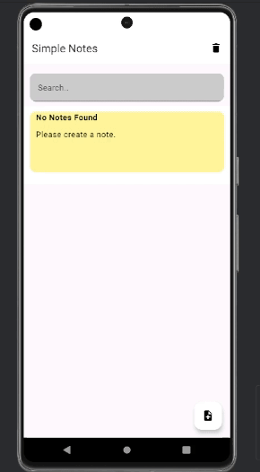
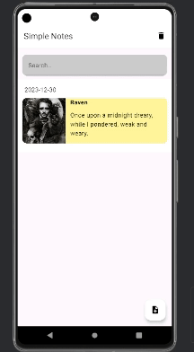
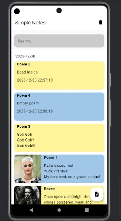

# Simple Notes
A typical notes app with photos building in Jetpack Compose.
# Features
* Jetpack Compose
* Room Database
* ViewModels
* Navigation
* LiveData
* All CRUD actions
* Multiple items in list view
# Create Note
Simple action to create note:

# Edit Note
Simple action to edit note:

# Search Note and delete all notes
Simple action to create note:

# What I'm planning to add in future update
* Add button to delete a single note
* Created UI tests
* Switch from Room to Dagger in a new branch 
* Create same project in 